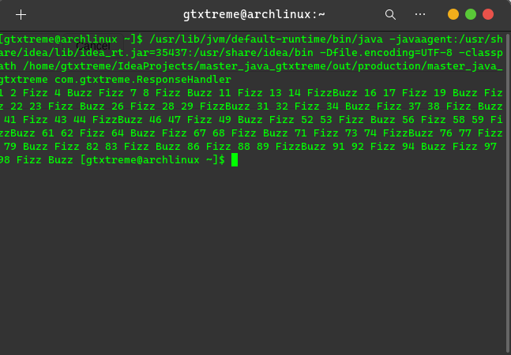

# Solving the FizzBuzz Problem using TDD (Test Driven Development)

## Approach 

### FizzBuzzer
- Has *three* tests for each of the conditions
- **Buzz** - When number is divisible by 5
- **Fizz** - When number is divisible by 3
- **FizzBuzz** - When number is divisible by 5 and 3 both (or 15)

### ResponseHandler

- Handles the response from the FizzBuzz class

## Outputs/ Screenshots
As required by Problem Statement

